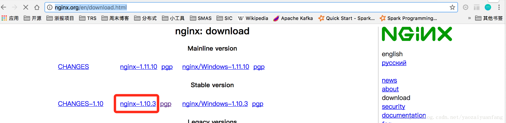
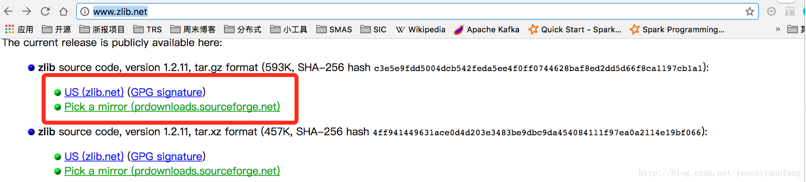
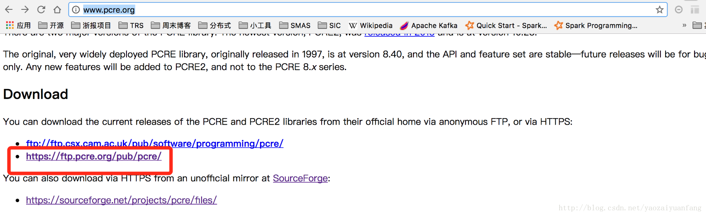
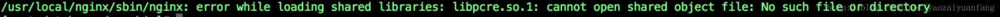

[toc]
# 1. 系统描述
**由于系统环境为RedHat 6.3 64bit，以下的安装命令都是基于RedHat准确，具体如下**
# 1. 安装准备
## 1.1 下载Nginx:http://nginx.org/en/download.html，下载版本：nginx-1.10.3

## 1.2下载zlib：http://www.zlib.net/， 下载版本：zlib-1.2.11

## 1.3下载Perl:http://www.pcre.org/，  下载版本：pcre-8.02


# 2. 部署安装
## 2.1 安装 pcre
```script
tar -zxvf pcre-8.02.tar.gz
./configure
make
make install
```
默认安装到/usr/local/lib下即可。
安装完成后可以#ls -l /usr/local/lib/libpcre.so
## 2.2 安装nginx
```script
tar zxvf nginx-1.0.11.tar.gz
cd nginx-1.0.11
./configure --prefix=/usr/local/nginx  --with-poll_module   --with-http_stub_status_module
make && make install
```
## 2.3 管理nginx服务
```scripts
启动：
/usr/local/nginx/sbin/nginx
停止
/usr/local/nginx/sbin/nginx -s stop
重启
/usr/local/nginx/sbin/nginx  -s reload
查看端口占用状态
netstat -autlp| grep nginx
```
# 3. 启动报错

```scripts
查询发现是部分linux系统存有的问题
解决方法：
ln -s /usr/local/lib/libpcre.so.1 /lib64
解决网址：http://www.qttc.net/201208194.html
```