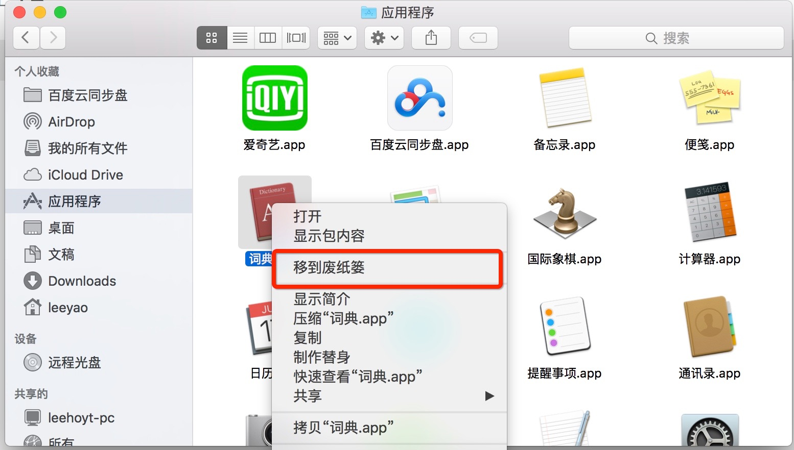

#### 删除应用到废纸篓

#### 扫尾工作
删除应用程序的库文件，缓存，首选项
卸载某些应用程序后会留下一些预置文件和缓存等，一般这些文件没有其他影响，但是可以进行应用程序的文件清空，可以通过这些路径进行删除：

 1. ~/资源库/Application Support/(应用程序名称)
 2. ~/资源库/PreferencePanes/(应用程序名称)
 3. ~/资源库/Caches/(应用程序名称)

**注：有时你查找到的可能不是应用程序的名词，而是开发商的名称，所以在进行删除操作的过程中谨慎进行，以防误删操作**