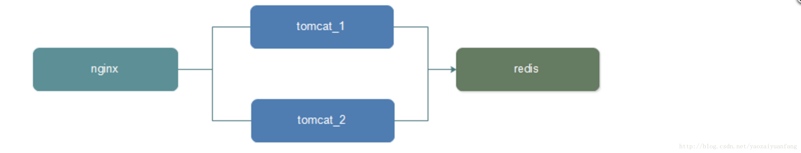

[toc]
# 1.需求描述
**现有的系统部署方式采用Nginx+tomcat6进行单机部署**
**系统更新或节点当机将直接导致系统无法访问**
# 2.环境准备
**由于现有系统环境为RedHat 6.3 64bit，以下的安装命令都是基于RedHat准确，具体如下**
**结构图**

## 2.1 Nginx安装
[具体安装路径链接](https://yaolipro.github.io/2017-02-24-nginx-install.html)
## 2.2 Tomcat7安装
**Tomcat7直接解压缩方式安装就行**
## 2.3 redis安装
**系统现有redis，该次操作直接沿用之前的redis**
# 3. 环境配置
## 3.1 Nginx配置
**修改/usr/local/nginx/conf/nginx.conf配置文件，添加IP负载配置**
```java
http {
    upstream site {
        server  127.0.0.1:8080;
        server  127.0.0.1:8081;
    }
    server {
        listen       80;
        server_name  localhost;
    }
}
```
## 3.2 Tomcat Session共享配置

 1. 添加redis session集群依赖的jar包到 TOMCAT_BASE/lib 目录下
 [tomcat-redis-session-manager-2.0.0.jar](https://github.com/izerui/tomcat-redis-session-manager/blob/master/jar/tomcat-redis-session-manager-2.0.0.jar?raw=true)
 [jedis-2.5.2.jar](https://github.com/izerui/tomcat-redis-session-manager/blob/master/jar/jedis-2.5.2.jar?raw=true)
 [commons-pool2-2.2.jar](https://github.com/izerui/tomcat-redis-session-manager/blob/master/jar/commons-pool2-2.2.jar?raw=true)
 2. 修改 TOMCAT_BASE/conf 目录下的 context.xml 文件

```java
<Context>
      <Valve className="com.orangefunction.tomcat.redissessions.RedisSessionHandlerValve" />
      <Manager className="com.orangefunction.tomcat.redissessions.RedisSessionManager"
           host="localhost"
           port="6379"
           database="0"
           maxInactiveInterval="60" />
</Context>
```
重启tomcat，session存储即可生效
网页链接：https://github.com/izerui/tomcat-redis-session-manager
# 4.进行验证