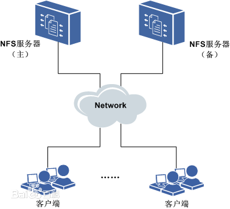

## 1.上下文
* 算法开发需要在多个Ubuntu机器上共享模型文件
* 具体共享机器：127.0.0.95/96/97/98

## 2.知识准备
* NFS（Network File System）即网络文件系统，是 FreeBSD 支持的文件系统中的一种，它允许网络中的计算机之间通过 TCP/IP 网络共享资源。在 NFS 的应用中，本地 NFS 的客户端应用可以透明地读写位于远端 NFS 服务器上的文件，就像访问本地文件一样。


## 3.具体操作
* 实际配置方案可参考[这里](http://blog.topspeedsnail.com/archives/908)
* 实际配置方案：
	* NFS Server节点：127.0.0.95
    	实际存储目录：/www
	* NFS Client节点：127.0.0.96/97/98
		共享存储目录：/nfs_share


## 4.挂载操作
```
sudo /bin/mount 127.0.0.95:/nfs /nfs_share 
```

备注：
```
samba搭建的对外文件共享空间
NFS搭建文件共享
```