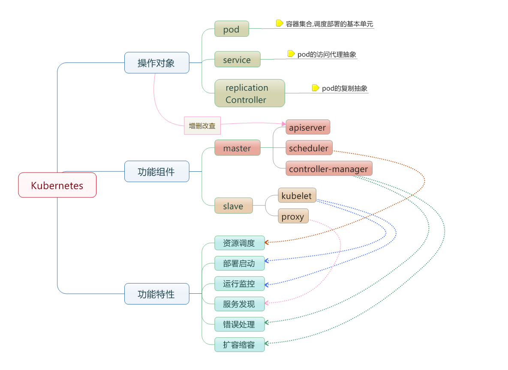

官方文档：(https://kubernetes.io/docs/home/)

基本组件理解：(http://blog.fatedier.com/2016/06/24/demystifying-kubernetes-and-deployment/)

Kubernetes如何使用kube-dns实现服务发现：(http://blog.tenxcloud.com/?p=1726)

(http://docs.kubernetes.org.cn/31.html)

Harbor用户机制、镜像同步和与Kubernetes的集成实践：(https://www.kubernetes.org.cn/1738.html)

