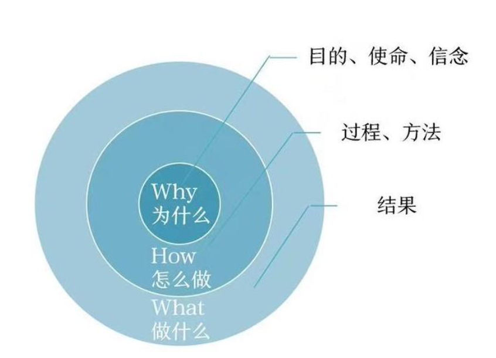

## 黄金圈法则结构
* Why：为什么做这个项目？
* How：如何做：过程、方法？
* What：有什么价值？
* 适合项目介绍、案例分享类演讲;

## PREP结构[总分总结构]
* Point：观点
* Reason：理由
* Example：案例
* Point：再次强调
* 适合技术研讨、辩论类讲演

## 时间轴结构
* 过去
* 现在
* 未来
* 体现了事物发展的规律和趋势，而通过这种趋势，我们可以去预测未来
* 适合产品介绍、技术迭代、案例分享类讲演

## 金字塔结构
* 问题—原因—对策—结果
* 适合技术创新、产品演示类讲演

## 关于PPT制作
* 凡是复杂的、抽象的数据、内容都有转换为图像
* 增加美感
	- 黄金比例16:9
	- 先定主色调、辅色不超过2种
	- 对齐、居中

## 其他技巧
* 口语化
* 制造噱头，试图让观众记住点什么？

---
That's all!
