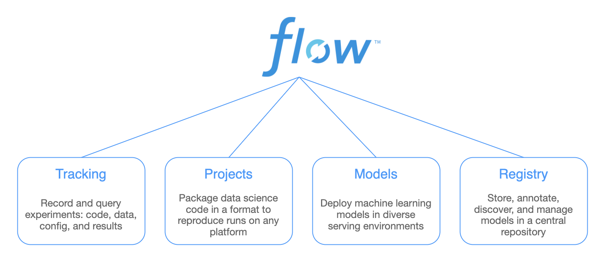

> An open source platform for the machine learning lifecycle
> https://mlflow.org/

### 上下文
* 为开发者提供类似谷歌TFX、Facebook FBLearner Flow等平台类似好处
* 可以支持任何工具和算法

### 项目架构



#### MLflow Tracking
* 记录和查询实验：代码、数据、配置和结果
* https://www.mlflow.org/docs/latest/tracking.html

#### MLflow Projects
* 可在任何平台上重复运行的打包格式
* https://www.mlflow.org/docs/latest/projects.html

#### MLflow Models
* 将模型发送到各种部署工具的通用格式
* https://www.mlflow.org/docs/latest/models.html

#### Model Registry
* 中央存储库：存储、注释、发现和管理模型
* https://mlflow.org/docs/latest/model-registry.html


### 项目使用
* [Anaconda](https://docs.conda.io/projects/conda/en/latest/user-guide/install/)环境安装，可以便捷获取包且对包能够进行管理，同时对环境可以统一管理的发行版本
#### mlflow安装

```
pip install mlflow
OR
conda install mlflow
```

#### UI启动
* examples/mlflow_tracking.py

```
cd examples
mlflow ui
```

#### 模型运行

```
# 模型生成
python3 sklearn_logistic_regression/train.py
# API启动
mlflow models serve -m runs:/<Model_id>/model --port 1234
可能报错：mlflow.utils.process.ShellCommandException: Non-zero exitcode: 1
mlflow models serve -m runs:/<Model_id>/model --port 1234 --no-conda
```

### 流处理Demo
* https://github.com/mlflow/mlflow/tree/master/examples/multistep_workflow

### 思考
* 官方待引入（MLflow Monitoring）
* MLFlow现阶段还是类似Pipeline的辅助工具，定义了Pipeline工具和标准，缺少AI平台概念
* 如何与Spark、Docker做集成

---
That's all!
