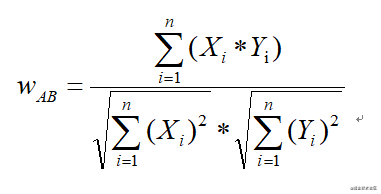
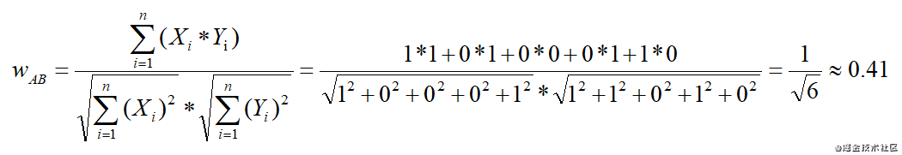
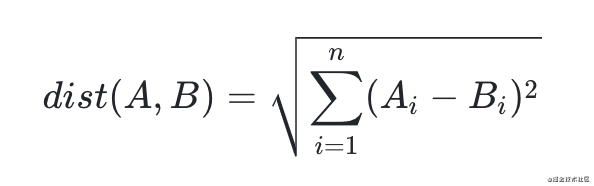
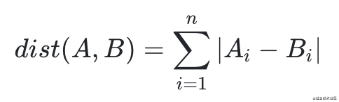

### 余弦距离(Cosine distance)
#### 余弦相似度原理
* 用向量空间中的两个向量夹角的余弦值作为衡量两个个体间差异大小的度量，值越接近1，就说明夹角角度越接近0°，也就是两个向量越相似，就叫做余弦相似
* 余弦相似度公式具体如下：



#### 余弦实际应用
* 现在假设：A用户喜欢a,b,d；B用户喜欢b,c,e；C用户喜欢c,d；D用户喜欢b,c,d；E用户喜欢a,d，建立物品-用户的倒排表，列出每个物品都被哪些用户喜欢，其中“1”表示喜欢，“0”表示不喜欢。注意：这里的喜欢行为可以理解成是用户在产品上触发的交互，例如点击，评论，点赞，收藏等。具体如下：


* 利用前面说到的余弦定理公式计算两个物品间的相似度，例如：将物品a和b分别看作是多维空间中的两个向量，则有：a（1,0,0,0,1）；b（1,1,0,1,0），所以物品a和物品b的相似度为：



#### 代码实现

```
import numpy as np
vec1 = np.array([1, 3, 4])
vec2 = np.array([4, 2, 4])
d = np.dot(vec1,vec2)/(np.linalg.norm(vec1) * (np.linalg.norm(vec2)))
```

### 点积距离(Dot Product)
#### 点积相似度原理
* 两个向量的长度与它们夹角余弦的积
* 点积计算公式：a * b = |a| * |b| * cosθ 
* 点乘又叫向量的内积、数量积，是一个向量和它在另一个向量上的投影的长度的乘积；是标量。 
* 点乘反映着两个向量的“相似度”，两个向量越“相似”，它们的点乘越大。

#### 代码实现

```
import numpy as np
vec1 = np.array([1, 3, 4])
vec2 = np.array([4, 2, 4])
d = np.dot(vec1, vec2)
```

### 欧氏距离(Euclidean distance)
#### 欧氏相似度原理
* 欧氏距离（也称欧几里得度量）指在m维空间中两个点之间的真实距离，或者向量的自然长度（即该点到原点的距离）
* 欧式相似度公式具体如下：



#### 欧氏实际应用
* 在数据完整(无维度数据缺失)的情况下, 维度间的衡量单位是一致的, 否则需要标准化处理

#### 代码实现

```
import numpy as np
vec1 = np.array([1, 3, 4])
vec2 = np.array([4, 2, 4])
d = np.linalg.norm(vec1-vec2, ord=2)
# 或
d = np.sqrt(np.sum(np.square(vec1-vec2)))
```

### 曼哈顿距离(Manhattan distance)
#### 曼哈顿相似度原理
* 在欧几里得空间的固定直角坐标系上两点所形成的线段对轴产生的投影的距离总和
* 曼哈度相似度公式具体如下：



#### 曼哈顿实际应用
* 在数据完整(无维度数据缺失)的情况下, 需要将空间划分成网格, 然后以网格为单位来进行度量, 允许4个方向

#### 代码实现

```
import numpy as np
vec1 = np.array([1, 3, 4])
vec2 = np.array([4, 2, 4])
d = np.linalg.norm(vec1-vec2, ord=1)
# 或
d = np.sum(np.abs(vec1-vec2))
```

### 附录：
* 参考1：https://zhuanlan.zhihu.com/p/154108167
* 参考2：https://segmentfault.com/a/1190000019307297
