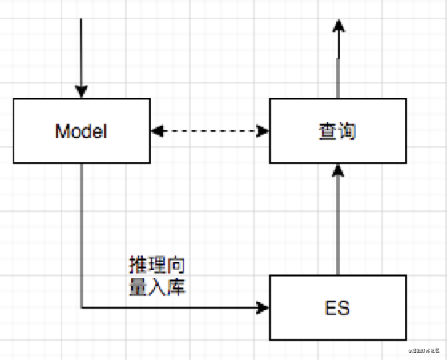
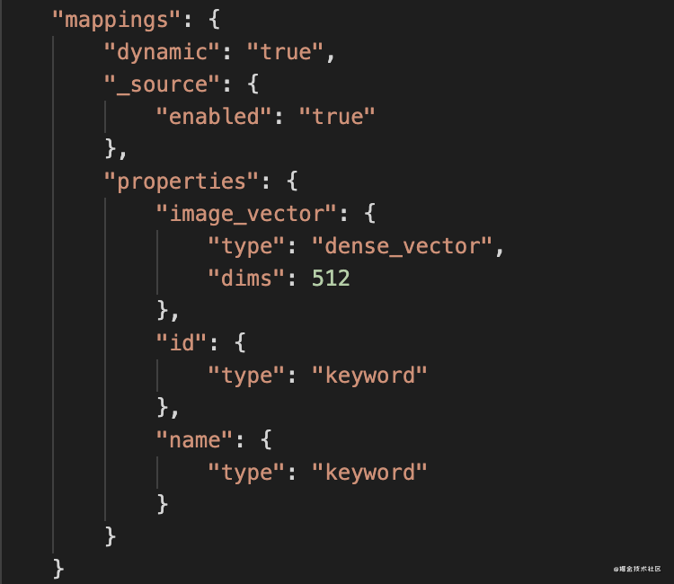
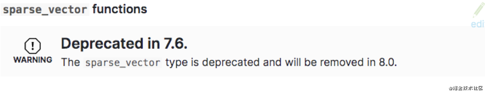

### 概述
* 为了让尝试“以图搜图”的相似图片检索的场景，基于ES向量索引计算和图片特征提取模型 VGG16 设计了一个以图搜图系统。 
* 开源地址：[https://github.com/yaolipro/image-retrieval](https://github.com/yaolipro/image-retrieval)

### 检索场景
* 推理流程：读取图片，算法生成特征向量
* 特征入库：把特征向量存入ES中
* 检索流程：线上实时向量检索
* 具体流程如下图：


### ES向量索引
* Dense Vector：存储稠密向量，存储为单值字段数组，数组的最大长度不能超过2048，每个文档的数组长度可以不同

* Sparse Vector：存储稀疏向量，存储为非嵌套类型的json对象，key是向量的位置，即integer类型的字符串，范围[0,65535]，value是向量值。但7.6版本后不在支持稀疏向量，请谨慎使用


### ES检索实现
* 提供余弦、曼哈顿、欧式和点积四种距离方式，具体代码如下：

```
# 余弦距离
script_query = {
    "script_score": {
        "query": {"match_all": {}},
        "script": {
            "source": "cosineSimilarity(params.query_vector, doc['image_vector']) + 1.0",
            "params": {"query_vector": query_vector}
        }
    }
}
# 曼哈顿距离
script_query = {
    "script_score": {
        "query": {"match_all": {}},
        "script": {
            "source": "1 / (1 + l1norm(params.queryVector, doc['image_vector']))", 
            "params": {
            "queryVector": query_vector
            }
        }
    }
}
# 欧几里德距离
script_query = {
    "script_score": {
        "query": {"match_all": {}},
        "script": {
            "source": "1 / (1 + l2norm(params.queryVector, doc['image_vector']))",
            "params": {
            "queryVector": query_vector
            }
        }
    }
}

# DotProduct实现
script_query = {
    "script_score": {
        "query": {"match_all": {}},
        "script": {
            "source": """
                double value = doc['image_vector'].size() == 0 ? 0 : dotProduct(params.query_vector, doc['image_vector']);
                return value;
                """,
            "params": {"query_vector": query_vector}
        }
    }
}
response = self.client.search(
    index=self.index_name,
    body={
        "size": search_size,
        "query": script_query,
        "_source": {"includes": ["id", "name", "face_vector"]}
    }
)
```

### ES服务端安装

```
docker run -it -d -p 9200:9200 -p 9300:9300 -e "discovery.type=single-node" docker.elastic.co/elasticsearch/elasticsearch:7.5.0
```

### 操作简介
* 下载工程源码：[https://github.com/yaolipro/image-retrieval](https://github.com/yaolipro/image-retrieval)
* 操作一：构建基础索引

```
python index.py
--train_data：自定义训练图片文件夹路径，默认为`<ROOT_DIR>/data/train`
--index_file：自定义索引文件存储路径，默认为`<ROOT_DIR>/index/train.h5`
```

* 操作二：使用相似检索

```
python retrieval.py --engine=es
--test_data：自定义测试图片详细地址，默认为`<ROOT_DIR>/data/test/001_accordion_image_0001.jpg`
--index_file：自定义索引文件存储路径，默认为`<ROOT_DIR>/index/train.h5`
--db_name：自定义ES或者Milvus索引库名，默认为`image_retrieval`
--engine：自定义检索引擎类型，默认为`numpy`，可选包括：numpy、faiss、es、milvus
```

### 总结
* 扩展 ElasticSearch 的能力使其支持向量检索
* 便于利用ElasticSearch分布式可扩展的能力
* 利用 ElasticSearch 查询函数和其他插件，便于扩展其他维度的检索
* ES向量计算都是线性扫描，耗时和文档数量、硬件性能正相关，请验证后使用

---
That's all!
