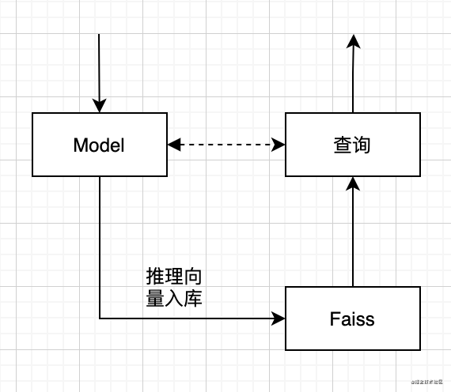

### 概述
* 为了让尝试“以图搜图”的相似图片检索的场景，基于Faiss向量索引计算和图片特征提取模型 VGG16 设计了一个以图搜图系统。 
* 开源地址：[https://github.com/yaolipro/image-retrieval](https://github.com/yaolipro/image-retrieval)

### 检索场景
* 推理流程：读取图片，算法生成特征向量
* 特征入库：把特征向量存入ES中
* 检索流程：线上实时向量检索
* 具体流程如下图：

### Faiss简介
* [faiss](https://github.com/facebookresearch/faiss)是为稠密向量提供高效相似度搜索和聚类的框架。由Facebook AI Research研发。 具有以下特性。
	- 提供多种检索方法
	- 速度快
	- 可存在内存和磁盘中
	- C++实现，提供Python封装调用。
	- 大部分算法支持GPU实现

### Faiss检索实现
* 提供欧氏和内积两种种距离方式，具体代码如下：

```
import faiss                   # make faiss available
index = faiss.IndexFlatL2(d)   # build the index
index.add(xb)                  # add vectors to the index
D, I = index.search(xq, k)     # actual search
```

```
import faiss                   # make faiss available
index = faiss.IndexFlatIP(d)   # build the index
index.add(xb)                  # add vectors to the index
D, I = index.search(xq, k)     # actual search
```

### 操作简介
* 下载工程源码：[https://github.com/yaolipro/image-retrieval](https://github.com/yaolipro/image-retrieval)
* 操作一：构建基础索引

```
python index.py
--train_data：自定义训练图片文件夹路径，默认为`<ROOT_DIR>/data/train`
--index_file：自定义索引文件存储路径，默认为`<ROOT_DIR>/index/train.h5`
```

* 操作二：使用相似检索

```
python retrieval.py --engine=faiss
--test_data：自定义测试图片详细地址，默认为`<ROOT_DIR>/data/test/001_accordion_image_0001.jpg`
--index_file：自定义索引文件存储路径，默认为`<ROOT_DIR>/index/train.h5`
--db_name：自定义ES或者Milvus索引库名，默认为`image_retrieval`
--engine：自定义检索引擎类型，默认为`numpy`，可选包括：numpy、faiss、es、milvus
```

### 扩展阅读
* 检索速度优化[方案](https://github.com/facebookresearch/faiss/wiki/Faster-search)
* 索引内存优化[方案](https://github.com/facebookresearch/faiss/wiki/Lower-memory-footprint)
* GPU运行推理[方案](https://github.com/facebookresearch/faiss/wiki/Running-on-GPUs)

---
That's all!