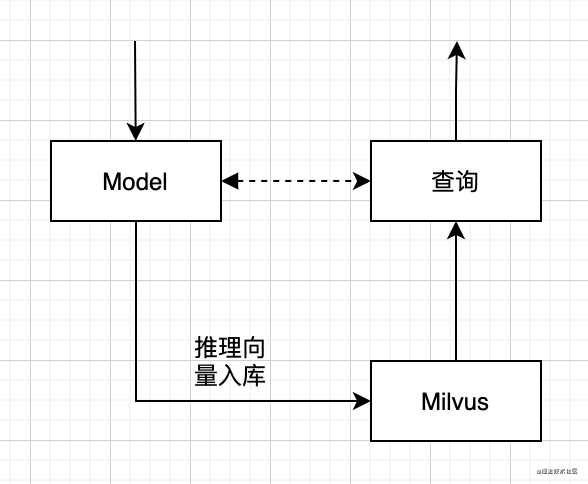

### 概述
* 为了让尝试“以图搜图”的相似图片检索的场景，基于ES向量索引计算和图片特征提取模型 VGG16 设计了一个以图搜图系统。 
* 开源地址：[https://github.com/yaolipro/image-retrieval](https://github.com/yaolipro/image-retrieval)

### 检索场景
* 推理流程：读取图片，算法生成特征向量
* 特征入库：把特征向量存入Milvus中
* 检索流程：线上实时向量检索
* 具体流程如下图：

### Milvus服务端安装
* 安装指南：https://milvus.io/cn/docs/milvus_docker-cpu.md <br>
* 下载配置

```
  mkdir -p milvus/conf && cd milvus/conf
  wget https://raw.githubusercontent.com/milvus-io/milvus/0.10.6/core/conf/demo/server_config.yaml
```

* 服务启动

```
  docker run -d --name milvus_cpu_0.11.0 \
  -p 19530:19530 \
  -p 19121:19121 \
  -v <ROOT_DIR>/milvus/db:/var/lib/milvus/db \
  -v <ROOT_DIR>/milvus/conf:/var/lib/milvus/conf \
  -v <ROOT_DIR>/milvus/logs:/var/lib/milvus/logs \
  -v <ROOT_DIR>/milvus/wal:/var/lib/milvus/wal \
  milvusdb/milvus:0.10.6-cpu-d022221-64ddc2
```

### Milvus向量索引建库
* 此处选用已落盘的h5py向量库进行建库
* 检索类型为内积：MetricType.IP

```
  # 1. 读取索引
  h5f = h5py.File(index_dir, 'r')
  self.retrieval_db = h5f['dataset_1'][:]
  self.retrieval_name = h5f['dataset_2'][:]
  h5f.close()
  # 2. 入库Milvus
  if self.index_name in self.client.list_collections()[1]:
      self.client.drop_collection(collection_name=self.index_name)
  self.client.create_collection({'collection_name': self.index_name, 'dimension': 512, 'index_file_size': 1024, 'metric_type': MetricType.IP})
  self.id_dict = {}
  status, ids = self.client.insert(collection_name=self.index_name, records=[i.tolist() for i in self.retrieval_db])
  for i, val in enumerate(self.retrieval_name):
      self.id_dict[ids[i]] = str(val)
  self.client.create_index(self.index_name, IndexType.FLAT, {'nlist': 16384})
  # pprint(self.client.get_collection_info(self.index_name))
  print("************* Done milvus indexing, Indexed {} documents *************".format(len(self.retrieval_db)))
```

### Milvus检索实现
* 根据加载索引时的定义，此处检索采用点积距离计算方式，具体代码如下：

```
_, vectors = self.client.search(collection_name=self.index_name, query_records=[query_vector], top_k=search_size, params={'nprobe': 16})
```

* 可切换至欧氏：MetricType.L2

### 操作简介
* 下载工程源码：[https://github.com/yaolipro/image-retrieval](https://github.com/yaolipro/image-retrieval)
* 操作一：构建基础索引

```
python index.py
--train_data：自定义训练图片文件夹路径，默认为`<ROOT_DIR>/data/train`
--index_file：自定义索引文件存储路径，默认为`<ROOT_DIR>/index/train.h5`
```

* 操作二：使用相似检索

```
python retrieval.py --engine=milvus
--test_data：自定义测试图片详细地址，默认为`<ROOT_DIR>/data/test/001_accordion_image_0001.jpg`
--index_file：自定义索引文件存储路径，默认为`<ROOT_DIR>/index/train.h5`
--db_name：自定义ES或者Milvus索引库名，默认为`image_retrieval`
--engine：自定义检索引擎类型，默认为`numpy`，可选包括：numpy、faiss、es、milvus
```

### 总结
* 基于库的管理方式便捷易懂
* 使用姿势类似ES，但性能优于ES
* 由于当前Milvus只支持向量检索，不支持标量相关，如果涉及标量过滤需要自建业务库
* Milvus社区后续会支持分布式，可以更加方便的应对大索引场景

---
That's all!

