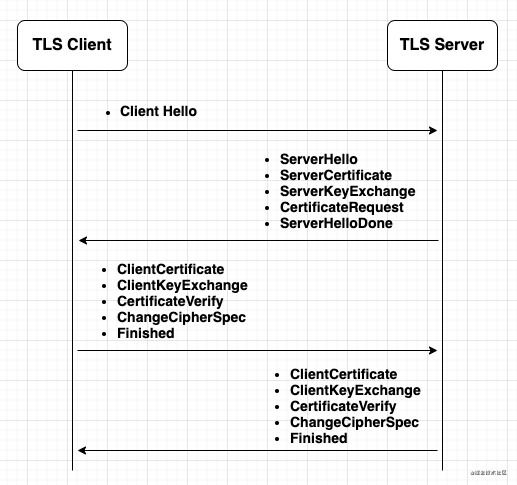

### 协议简介
* HTTPS 即 HTTP over TLS(Transport Layer Security)，是一种在加密信道进行 HTTP 内容传输的协议

### 运行流程
* 基本思路是采用公钥加密法，也就是说，客户端先向服务器端索要公钥，然后用公钥加密信息，服务器收到密文后，用自己的私钥解密
* 握手阶段
	- 客户端向服务器端索要并验证公钥
	- 双方协商生成"对话密钥"
* 通信阶段
	- 双方采用"对话密钥"进行加密通信

#### TLS握手
* 
* 客户端发送一个 ClientHello 消息到服务器端，消息中同时包含了它的 TLS 版本，可用的加密算法、压缩算法、客户端生成的随机数（稍后用于生成“对话密钥”）
* 服务器端向客户端返回一个 ServerHello 消息，消息中包含了服务器端的 TLS 版本，服务端生成的随机数（稍后用于生成“对话密钥”）、服务器所选择的加密和压缩算法，以及数字证书认证机构（Certificate Authority，缩写 CA）签发的服务器公开证书，证书中包含了公钥。客户端会使用这个公钥加密接下来的握手过程，直到协商生成一个新的对称密钥。证书中还包括了该证书所应用的域名范围（Common Name，简称 CN），用户客户端验证身份
* 客户端根据自己的信任CA列表，验证服务器端的证书是否可信。如果认为可信，客户端会生成一串伪随机数，使用服务器的公钥加密它。这串随机数会被用于生成新的对称密钥
* 服务器端使用自己的私钥解密上面提到的随机数，然后使用这串随机数生成自己的对称主密钥
* 客户端发送一个 Finished 消息给服务器端，使用对称密钥加密这次通讯的一个散列值
* 服务器端生成自己的 hash 值，然后解密客户端发送来的信息，检查这两个值是否对应。如果对应，就向客户端发送一个 Finished 消息，也使用协商好的对称密钥加密

#### TLS通信
* 从现在开始，接下来整个 TLS 会话都使用对称秘钥进行加密，传输应用层（HTTP）内容

### TLS 证书机制
* HTTPS 过程中很重要的一个步骤，是服务器需要有 CA 颁发的证书，客户端根据自己的信任 CA 列表验证服务器的身份。现代浏览器中，证书验证的过程依赖于证书信任链
* 所谓证书信任链，即一个证书要依靠上一级证书来证明自己是可信的，最顶层的证书被称为根证书，拥有根证书的机构被称为根 CA
* 还是以 Github 为例，在浏览器中我们可以看到它的证书信任链如下：

```
DigiCert High Assurance EV Root CA -> DigiCert SHA2 Extended Validation Server CA -> Github.com

从上到下即 Root CA -> 二级 CA -> 网站
```

* 前面提到，证书当中包括 CN(Common Name)，浏览器在验证证书的同时，也会验证 CN 的正确性。即不光需要验证“这是一个合法的证书”，还需要验证“这是一个用于 Github.com 的证书”
* 在使用 curl 等工具时，我们还可以自行选择证书进行信任。有权威的信任，最终都要落到一个单点信任，不管是 Root CA，还是微软，苹果，谷歌等操作系统厂商

### 总结
* 如何保证公钥不被篡改？
	- 解决方法：将公钥放在数字证书中。只要证书是可信的，公钥就是可信的
* 公钥加密计算量太大，如何减少耗用的时间？
	- 解决方法：每一次对话（session），客户端和服务器端都生成一个"对话密钥"（session key），用它来加密信息。由于"对话密钥"是对称加密，所以运算速度非常快，而服务器公钥只用于加密"对话密钥"本身，这样就减少了加密运算的消耗时间
    
### 扩展
* TLS 的完整过程需要三个算法（协议），密钥交互算法，对称加密算法，和消息认证算法（TLS 的传输会使用 MAC(message authentication code) 进行完整性检查），以 Github 网站使用的 TLS 为例，使用浏览器可以看到它使用的加密为 TLS_ECDHE_RSA_WITH_AES_128_GCM_SHA256。其中密钥交互算法是 ECDHE_RSA，对称加密算法是 AES_128_GCM，消息认证（MAC）算法为 SHA256。

### 附录
* https://github.com/skyline75489/what-happens-when-zh_CN#tls
* https://hit-alibaba.github.io/interview/basic/network/HTTPS.html
* https://www.ruanyifeng.com/blog/2014/02/ssl_tls.html
* https://zhuanlan.zhihu.com/p/30655259