### 背景概述
* 插件化机制使框架与各个模块的实现相解耦，模块统一抽象出基本数据结构与框架的交互接口，模块只要符合统一接口即可做到插件替换。

### 架构图
* PluginCore：通过Plugin Manager调用算法，负责业务逻辑的实现
* PluginManger: 通过读取配置文件，负责各种插件的加载、管理、甚至热更新

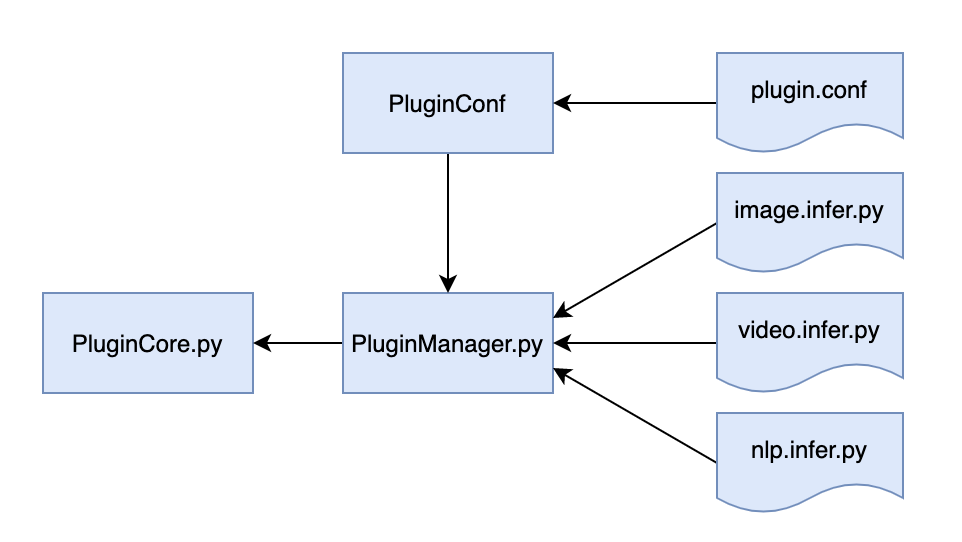

### 插件实现
#### __import__()函数
* 用于动态加载类和函数。如果一个模块经常变化就可以使用 __import__() 来动态载入
* 函数语法：

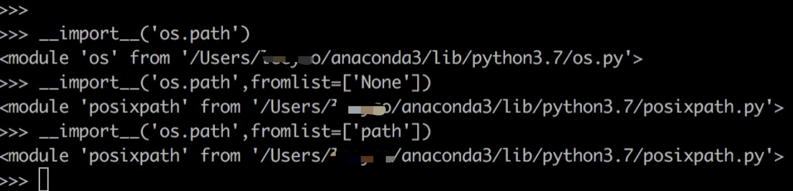

```
__import__(name, globals=None, locals=None, fromlist=(), level=0)
	name[必须]：模块名称
	globals - 全局变量集合，默认为None
	locals - 局部变量集合，默认为None
	fromlist - 是否导入子模块，看上去是导入模块的列表。但实际是一个判断条件，
	只要设置为非空的值，且模块名称是带有子模块的，将导入子模块。
	例如：sys.path。当不设置时，返回sys，
	如果设置为非空值，则返回ntpath（path模块）
	level - 绝对或者相对导入
```

#### 加载方式
* 直接引用加载【老版】

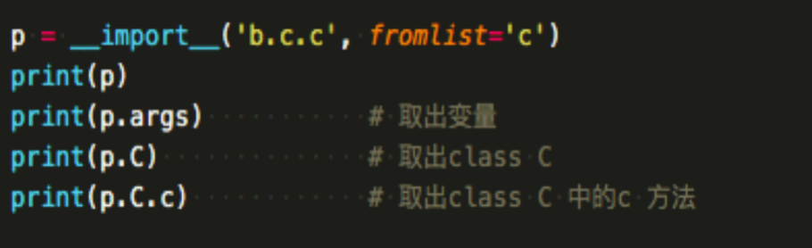

* Importlib包方式【新版】

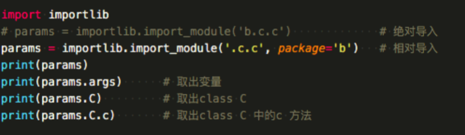

### 算法插件服务
#### 插件定义
* 每个插件需要实现公共数据接口和接口方法。

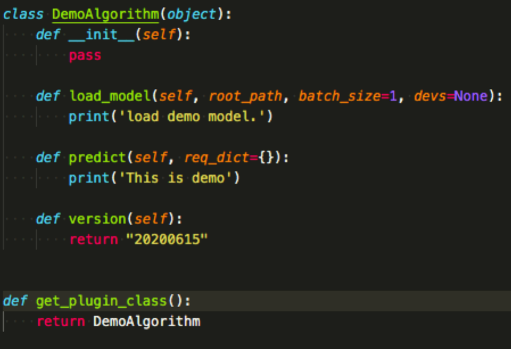

```
load_model(self, root_path, batch_size=1, devs=None):
：模型加载入口
predict(self, req_dict={}):
：推理算法入口
version(self):
：版本方法
```

#### 配置化管理
* 插件通过配置文件组织可选插件以及 插件名 、插件路径  等信息。

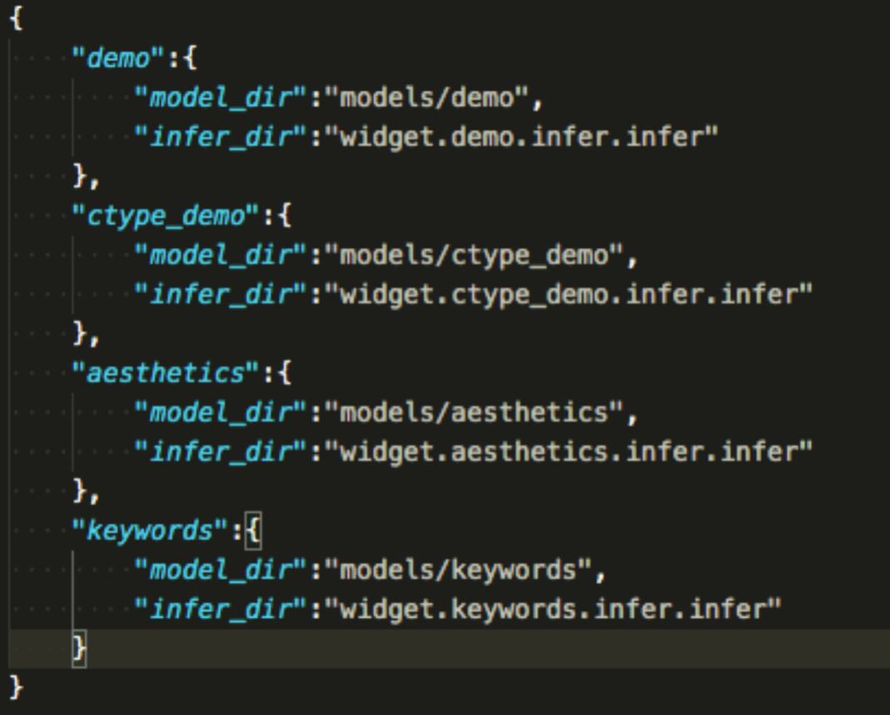

```
key：配置插件模块的名字
	key: str,
model_dir：配置插件内部方法名字
	model_dir : str, 
infer_dir：配置插件具体加载路径（工程下绝对路径）
	infer_dir : str, 
```

#### 插件管理器
* 定义了插件管理的方法，插件功能加载、插件获取方法实现

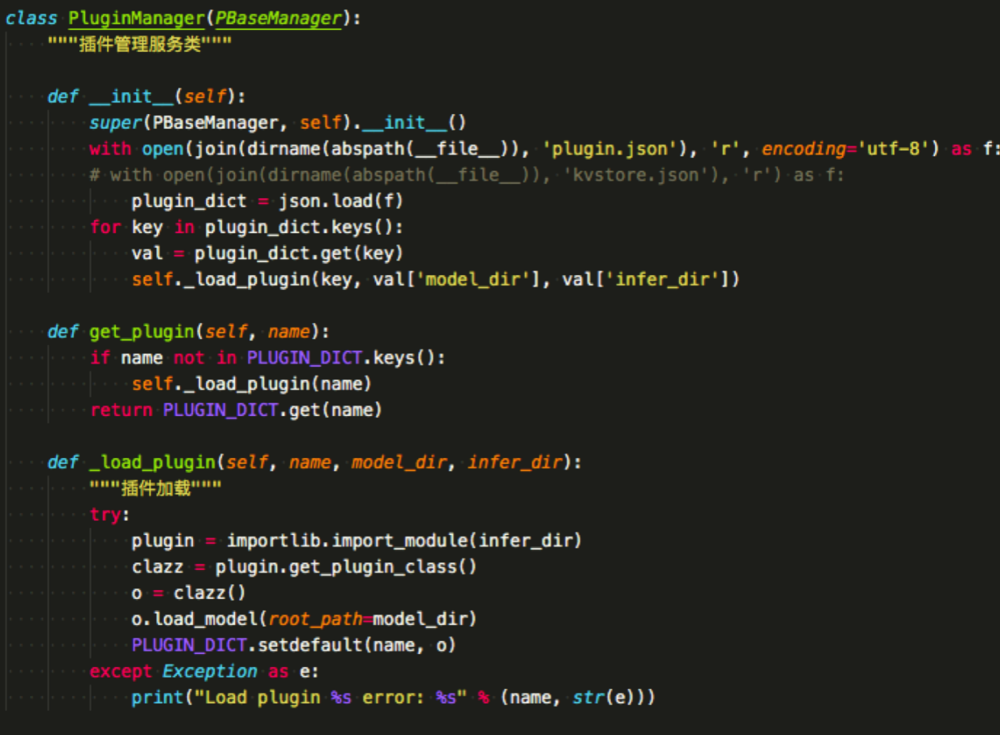

```
_load_plugin(self, name, dir)
：插件加载入口，识别配置加载插件
get_plugin(self, name):
：插件获取接口，该方法获取插件
```

### 插件扩展
* 有些时候需要用解耦调用C代码，以linux平台为例说明python调用.so文件的使用方法

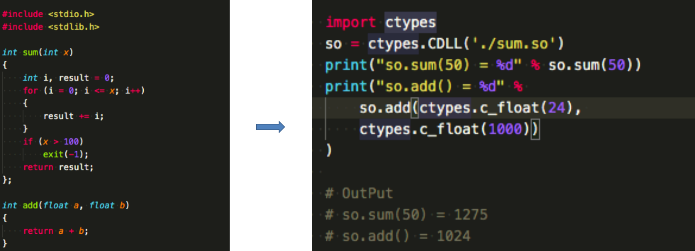

* 构建C语言插件

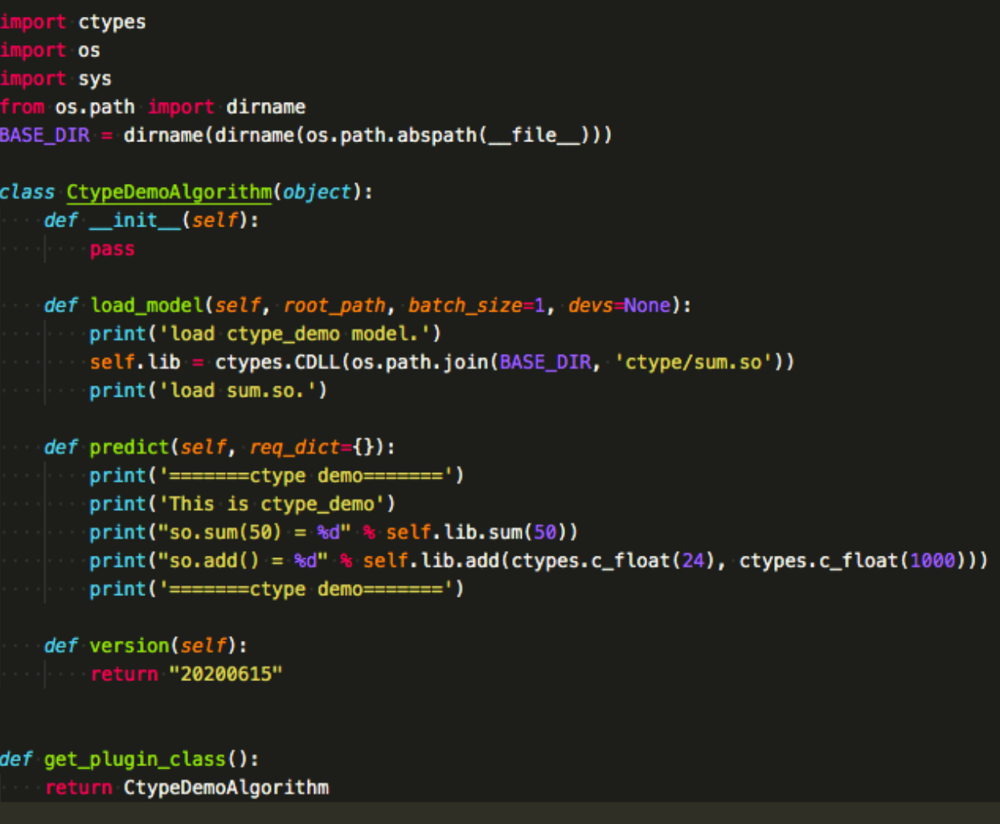

### 插件热加载
* Importlib.reload方法实现

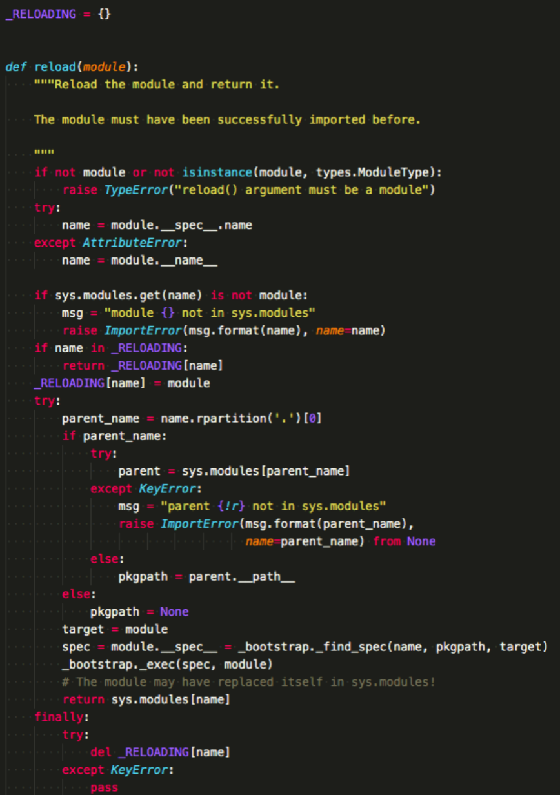

### 插件优势
* 高可扩展：开发者可自由实现符合业务需求的模块插件，直接替换插件配置就可以实现业务扩展
* 发布灵活：插件可集中发布也可单独发布，配合插件生命周期管理甚至可以实现插件的单独更新
* 代码解耦：各个插件模块开发和部署都单独进行，能方便的扩展和自由实现符合业务需求的插件

### 微内核架构
* 微内核架构是插件架构模式的一种典型实现，常常把微内核架构也叫做插件式架构
* 当前微内核架构也被应用在许多我们熟知的产品，比如：操作系统、Chrome浏览器、Eclipse编辑器等
#### 架构图
* 微内核架构包含两个组件：核心系统（core system）和插件模块（plug-in component）
* 核心系统只包含让系统可以运作的最小功能
* 插件模块，则包含一些特殊处理逻辑、额外的功能，用于提供更多的业务能力

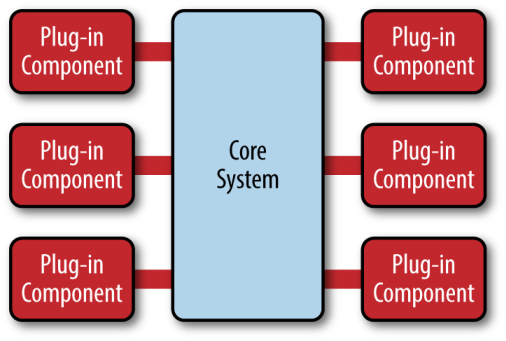

---
That's all!
