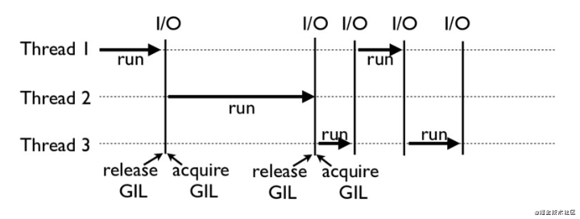
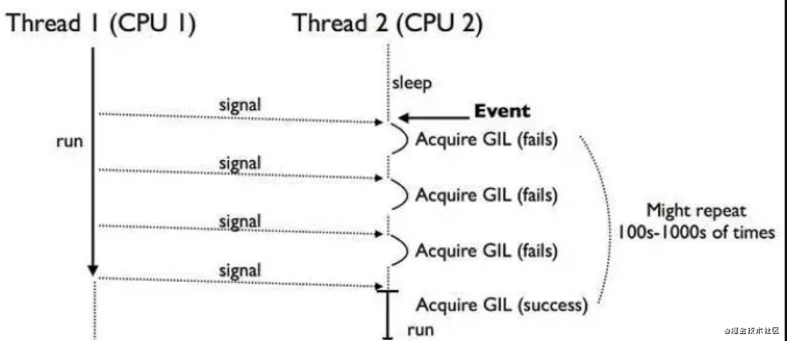

> 全局解释器锁GIL(Global Interpreter Lock)

## 一、GIL理解
* GIL指定同时只允许一个线程控制Python解释器。
* GIL是CPU限制型和多线程代码中的性能瓶颈。
* GIL导致Python多线程属于伪并发的多线程。
* GIL只在CPython解释器上存在。

### GIL的影响
* Python中同一时刻有且只有一个线程会执行；
* Python中的多个线程由于GIL锁的存在无法利用多核CPU；
* Python中的多线程不适合计算机密集型的程序；
* 问题：GIL的存在使程序无法充分利用CPU进行运算，那么它真的一无是处么？ 
	- 计算密集型程序【比如计算圆周率、对视频进行高清解码等等，全靠CPU的运算能力】
	- IO密集型程序【比如网络数据的收发，大文件的读写，这样的程序称为IO密集型程序】

### 为什么选择GIL作为解决方案呢？
* 内核CPython会大量使用C语言库，但大部分C语言库都不是原生线程安全的(线程安全会降低性能和增加复杂度)
* 早期实用解决方案，解决CPython开发人员在Python生命中早期面临的一个线程安全难题。
* 后期由于Python内核基于C语言编写，所以开发人员为Python需要的功能编写许多C库扩展。为了防止不一致的更改，继续延用GIL

### 为什么还没有删除GIL？
* Python的开发人员对此有很多抱怨，但是Python这样流行的语言删除GIL，向下兼容代价太大了
* Py3社区也尝试过执行此操作，不过导致性能下降又加上了（破坏了现有的C扩展，这些扩展依赖于GIL，需要程序维护多线程，相对性能下降）
* Py3社区GIL重大改进：
	- 计算密集和I/O密集共存的程序中，GIL致使I/O密集的线程饿死，因为没有机会从CPU绑定的线程中获取GIL。所以Python内置了一种机制，强制线程在固定间隔后释放GIL，并且如果没有其他人获得GIL，则相同的线程才可以继续使用它。
	- 这种机制的依然存在问题大多数情况下，CPU密集型线程会在其他线程获取GIL之前重新获取GIL。具体如下[可视化](https://juejin.cn/post/6932355242721804296)。
	- Python3.2中社区添加了一种机制，可以在其他线程有机会运行之前不允许当前线程重新获取GIL。

## 二、GIL原理
### GIL如何工作
* 下图就是一个GIL在Python程序中的工作示例。
* 其中，线程1、2、3轮流执行，每一个线程在执行是，都会锁住GIL，以阻止别的线程执行；
* 同样的，每一个线程执行一段后，会释放GIL，以允许别的线程开始利用资源。



* 由于古老GIL机制，如果线程2需要在CPU2上执行，它需要先等待在CPU1上执行的线程1释放GIL（记住：GIL是全局的）
* 如果线程1是因为 i/o 阻塞让出的GIL，那么线程2必定拿到GIL。但如果线程1是因为timer ticks计数满100ticks(大概对应了1000个bytecodes)让出GIL，那么这个时候线程1和线程2公平竞争。
* 但要命的是，在Python 2.x, 线程1不会动态的调整自身的优先级，所以很大概率下次被选中执行的还是线程1，在很多个这样的选举周期内，线程2只能安静的看着线程1拿着GIL在CPU 1上欢快的执行。
* 极端一点的情况下，比如线程1使用了while True在CPU1上执行，那就真是“一核有难，八核围观”了，如下图所示：



* 整体来说，每一个Python的线程都是类似这样循环的封装，我们可以看看下面的代码

```
for(;;){
    if(--ticker < 0)
    /*Give another thread a chance*/
    PyThread_release_lock(interpreter_lock);
 
    /*Other threads may run now*/
 
    PyThread_acquire_lock(interpreter_lock,1);
}
 
bytecode = *next_instr++
switch (bytecode){
    /*execute the next instruction...*/
}
```

* 从上面的代码可以看出来，每个Python线程都会先检查ticker计数。只有ticker大于0的时候，线程才会去执行自己的bytecode。

```
python -c 'import sys;print sys.getcheckinterval()'
```

### GIL结构体
* 以下结构体就是GIL的定义
* locked用来指示是否上锁, 1表示已有线程上锁, 0表示锁空闲，
* lock_released和mutex来同步对locked的访问。

```
typedef struct {
    char 	locked; /* 0=unlocked, 1=locked */
    /* a <cond, mutex> pair to handle an acquire of a locked lock */
    pthread_cond_t 	lock_released;
    pthread_mutex_t 	mut;
} pthread_lock;
```

### GIL的获取与释放
* 线程对GIL的操作本质上就是通过修改locked状态变量来获取或释放GIL。所以主要的操作有两个:

```
PyThread_acquire_lock()
PyThread_release_lock()
```

* 以下是获取GIL的实现，可以看到，线程在其他线程已经获取GIL的时候，需要通过pthread_cond_wait()等待获取GIL的线程释放GIL。

```
/*获取GIL*/
int  PyThread_acquire_lock(PyThread_type_lock lock, int waitflag) 
{
    int success;
    pthread_lock *thelock = (pthread_lock *)lock;
    int status, error = 0;
    status = pthread_mutex_lock( &thelock->mut ); /*先获取mutex, 获得操作locked变量的权限*/
    success = thelock->locked == 0;
    if ( !success && waitflag ) { /*已有线程上锁,*/
        while ( thelock->locked ) {
            /*通过pthread_cond_wait等待持有锁的线程释放锁*/
            status = pthread_cond_wait(&thelock->lock_released,
                                       &thelock->mut);
        }
        success = 1;
    }
    if (success) thelock->locked = 1; /*当前线程上锁*/
    status = pthread_mutex_unlock( &thelock->mut ); /*解锁mutex, 让其他线程有机会进入临界区等待上锁*/
    if (error) success = 0;
    return success; 
}
```

* 以下是释放GIL的过程,特别注意最后一步, 通过pthread_cond_signal()通知其他等待(pthread_cond_wait())释放GIL的线程,让这些线程可以获取GIL。

```
/*释放GIL*/
void PyThread_release_lock(PyThread_type_lock lock)
{
    pthread_lock *thelock = (pthread_lock *)lock;
    int status, error = 0;
    status = pthread_mutex_lock( &thelock->mut ); /*通过mutex获取操作locked变量的权限*/
    thelock->locked = 0; /*实际的释放GIL的操作, 就是将locked置为0*/
    status = pthread_mutex_unlock( &thelock->mut ); /*解锁mutex*/
    status = pthread_cond_signal( &thelock->lock_released ); /*这步非常关键, 通知其他线程当前线程已经释放GIL*/
}
```

## 三、GIL调优
* 给线程加锁，会对python多线程的效率有不小的影响，使用多线程进行CPU密集型的操作，会存在频繁的上下文切换，效率低下

### 不要用C语言版本的Python解释器
* Python有多个解释器实现，包括C，Java，C＃和Python编写的CPython，Jython，IronPython和PyPy是最受欢迎的，GIL仅存在于CPython的原始Python实现中

### 让子线程运行其他语言代码
* 主线程运行Python代码，子线程运行C语言代码(C语言的动态库)
* CPython的优势就是与C模块的结合，因此可以借助Ctypes调用C的动态库来实现将计算转移，C动态库没有GIL可以实现对多核的利用。
* 深度算法 rcnn

### 多进程代替多线程
* 多进程可以利用多核CPU
* 通过使用多进程，我们并行运行了一定数量的python解释器，每一个进程都有私有的空间，有自己的GIL，并且每一个都串行运行，所以没有GIL之间的竞争
* 因此GIL不会成为问题。Python有一个multiprocessing模块，可以让我们像这样轻松地创建流程：

```
import time
from multiprocessing import Pool
COUNT = 10000000
start = time.clock()
def countdown(n):
    while n > 0:
        n -= 1

pool = Pool(processes=2)
start = time.clock()
r1 = pool.apply_async(countdown, [COUNT//2])
r2 = pool.apply_async(countdown, [COUNT//2])
pool.close()
pool.join()
print('Time used:', time.clock() - start)
# ('Time used:', 0.0017779999999998353)
```

* 时间没有下降到我们上面看到的一半，因为进程管理有自己的开销。多个进程比多个线程重，因此请记住，这可能会成为一个扩展瓶颈。


### 协程
* 在Python3.4之前，官方没有对协程的支持，存在一些三方库的实现，比如gevent和Tornado
* 3.4之后就内置了asyncio标准库，官方真正实现了协程这一特性。
* 在IO密集型的情况下，使用协程能提高最高效率
* 注意；协程不是任何单位，只是一个程序员YY出来的东西
* 协程的目的：手动实现“遇到IO切换 + 保存状态” 去欺骗操作系统，让操作系统误以为没有IO操作，将CPU的执行权限给你，从而单线程下实现并发

```
import time
#遇到IO切换（gevent） + 保存状态
from gevent import monkey  #猴子补丁
monkey.patch_all()  #监听所有的任务是否有IO操作
from gevent import spawn  #spawn(任务)
from gevent import joinall

COUNT = 10000000
start = time.clock()
def countdown(n):
    while n > 0:
        n -= 1

sp1 = spawn(countdown, COUNT//2)
sp2 = spawn(countdown, COUNT//2)

# sp1.start()
# sp2.start()
# sp1.join()
# sp2.join()
joinall([sp1, sp2])  #等同于上面六步

print('Time used:', time.clock() - start)
# ('Time used:', 0.40398999999999985)
```

### 问题
* 多进程利用多核优势，怎样发挥单核优势呢
* Python社区中一些人从CPython中删除GIL(eg：[Gilectomy](https://pythoncapi.readthedocs.io/gilectomy.html))

## 四、速度测试
* 测评结果

| 测试方式 | 测试时间 | 
--- | --- |
单线程 | 0.392953
多线程 | 0.910045
多进程 | 0.0017779999999998353
协程 | 0.40398999999999985

* 测试代码：

```
# -*- coding: utf-8 -*-
import time
COUNT = 10000000
start = time.clock()
def countdown(n):
    while n > 0:
        n -= 1
countdown(COUNT)
print("Time used:",(time.clock() - start))
# ('Time used:', 0.392953)

import time
from threading import Thread
COUNT = 10000000
start = time.clock()
def countdown(n):
    while n > 0:
        n -= 1
t1 = Thread(target=countdown, args=[COUNT // 2])
t2 = Thread(target=countdown, args=[COUNT // 2])
t1.start()
t2.start()
t1.join()
t2.join()
print("Time used:",(time.clock() - start))
# ('Time used:', 0.910045)

import time
from multiprocessing import Pool
COUNT = 10000000
start = time.clock()
def countdown(n):
    while n > 0:
        n -= 1
pool = Pool(processes=2)
start = time.clock()
r1 = pool.apply_async(countdown, [COUNT//2])
r2 = pool.apply_async(countdown, [COUNT//2])
pool.close()
pool.join()
print('Time used:', time.clock() - start)
# ('Time used:', 0.0017779999999998353)

import time
#遇到IO切换（gevent） + 保存状态
from gevent import monkey  #猴子补丁
monkey.patch_all()  #监听所有的任务是否有IO操作
from gevent import spawn  #spawn(任务)
from gevent import joinall
COUNT = 10000000
start = time.clock()
def countdown(n):
    while n > 0:
        n -= 1
sp1 = spawn(countdown, COUNT//2)
sp2 = spawn(countdown, COUNT//2)
# sp1.start()
# sp2.start()
# sp1.join()
# sp2.join()
joinall([sp1, sp2])  #等同于上面六步
print('Time used:', time.clock() - start)
# ('Time used:', 0.40398999999999985)
```

## 五、扩展
### 什么时候会释放GIL锁
	- 遇到像i/o操作，这种会有时间空闲情况 造成cpu闲置的情况会释放GIL
	- 会有一个专门ticks进行计数，一旦ticks数值达到100这个时候释放GIL锁，线程之间开始竞争GIL锁(说明:ticks这个数值可以进行设置来延长或者缩减获得GIL锁的线程使用cpu的时间)

### 互斥锁和GIL锁的关系
* GIL锁
	- GIL是Python解释层面的锁，解决解释器中多个线程的竞争资源问题
	- 保证同一时刻只有一个线程能使用到cpu
	- 语言层面本身维护锁机制用来保证线程安全
* 互斥锁
	- 线程互斥锁是Python代码层面的锁，解决Python程序中多线程共享资源的问题
	- 多线程时，保证修改共享数据时有序的修改
	- 不会产生数据修改混乱，线程锁，程序员需要自行加／解锁来保证线程安全;
* 案例：假设只有一个进程，这个进程中有两个线程 Thread1，Thread2，要修改共享的数据date，并且有互斥锁:

```
	1. 多线程运行，假设Thread1获得GIL可以使用cpu，这时Thread1获得互斥锁lock，Thread1可以改date数据(但并没有开始修改数据);
	2. Thread1线程在修改date数据前发生了i/o操作或者ticks计数满100((注意就是没有运行到修改data数据),这个时候 Thread1 让出了TIL，GIL锁可以被竞争);
	3. Thread1和Thread2开始竞争GIL(注意:如果Thread1是因为i/o阻塞让出的GIL，Thread2必定拿到GIL,如果Thread1是因为ticks计数满100让出GIL这个时候Thread1和Thread2公平竞争);
	4. 假设Thread2正好获得了GIL, 运行代码去修改共享数据date，由于Thread1有互斥锁lock，所以Thread2无法更改共享数据date,这时Thread2让出GIL锁, GIL锁再次发生竞争;
	5. 假设Thread1又抢到GIL，由于其有互斥锁Lock所以其可以继续修改共享数据data,当Thread1修改完数据释放互斥锁lock，Thread2在获得GIL与lock后才可对data进行修改
```

## 参考
* C互斥锁、信号量：https://www.cnblogs.com/luzhiyuan/p/4380793.html
* 理解GIL：https://www.youtube.com/watch?v=Obt-vMVdM8s&feature=youtu.be

---
That's all!