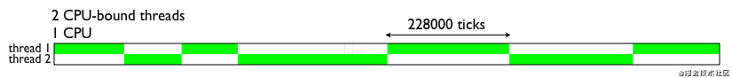
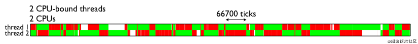
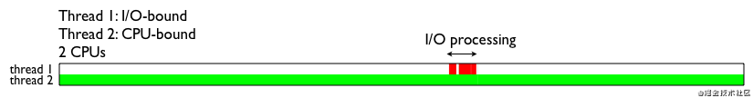
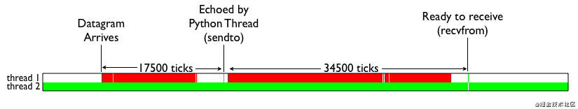

* 在这些图中，Python解释器刻度线沿X轴显示。
	- 两个横条表示正在执行的两个不同线程。
	- 白色区域表示线程完全空闲的时间。
	- 绿色区域指示线程何时保持GIL并正在运行。
	- 红色区域指示操作系统何时仅计划线程将其唤醒，并发现GIL不可用。
* 详见以下图例：


* 首先，这是在单个CPU系统上运行两个CPU绑定线程的行为。
	- 经过长时间的计算，线程之间会很好地交替。
* 详见以下图例：



* 其次，双核笔记本机器上启动代码。
	- 所有这些红色区域表示操作系统已在一个内核上调度了Python线程的时间，但由于另一个内核上的线程持有该线程而无法运行。



* 涉及一个I／O绑定线程与CPU绑定线程竞争。在此示例中，I／O线程仅回显UDP数据包。这是该线程的代码。

```
def thread_1（端口）：
    s =套接字（AF_INET，SOCK_DGRAM）
    s.bind（（“”，port））
    而True：
        msg，addr = s.recvfrom（1024）
        s.sendto（msg，addr）
```

* 另一个线程（线程2）只是在无意识地旋转。此图显示了向线程1发送UDP消息时发生的情况。



* 如您所料，大部分时间都花在运行CPU绑定线程上。但是，当接收到I/O时，I/O线程中会发生一系列活动。让我们放大该区域，看看发生了什么。



* 在此图中，您将看到为完成少量处理而使I/O绑定到GIL的难度。
* 在UDP消息的到达与s.recvfrom()调用的成功返回之间传递了大约17000个解释器滴答声（并注意所有GIL争用）
* 在执行s.sendto()与循环返回下一个s.recvfrom()之间传递了34000多个滴答。

> 简单的结论就是：Python的多线程在多核CPU上，只对于I/O密集型计算产生正面效果；而当有至少有一个CPU密集型线程存在，那么多线程效率会由于GIL而大幅下降。


* 速度测试

```
import time

COUNT = 10000000
start = time.clock()
def countdown(n):
    while n > 0:
        n -= 1
countdown(COUNT)
print("Time used:",(time.clock() - start))
# ('Time used:', 0.392953)

import time
from threading import Thread
COUNT = 10000000
start = time.clock()
def countdown(n):
    while n > 0:
        n -= 1
t1 = Thread(target=countdown, args=[COUNT // 2])
t2 = Thread(target=countdown, args=[COUNT // 2])
t1.start()
t2.start()
t1.join()
t2.join()
print("Time used:",(time.clock() - start))
# ('Time used:', 0.910045)
```

---
That's all!