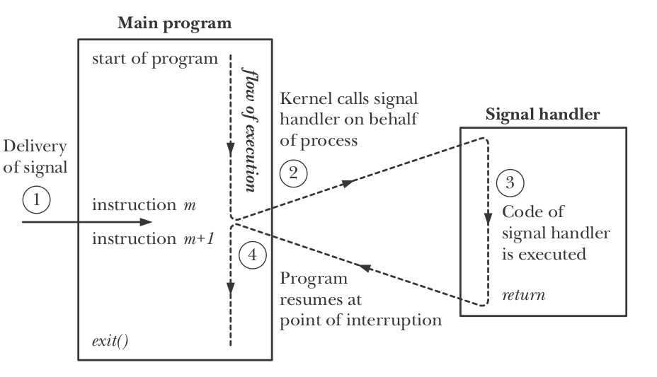
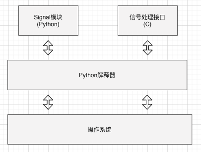
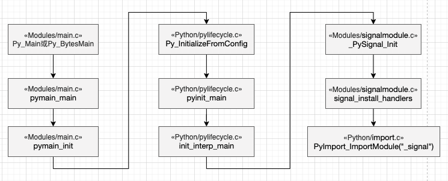

[TOC]

## Signals简介

在类`Unix`系统上，信号用于将各种信息发送到正在运行的进程，它们来自用户命令，其他进程以及内核本身。所以信号是对已发生事件进程的通知，也可以被描述为软件中断，因为在大多数情况下，它们会中断程序的正常执行流程。

## Linux信号

### 信号流转图

信号可以被内核或者进程发出，信号可以在子进程触发但是只能在主进程执行，具体信号流转图如下：



下面我们主要介绍内核发出的信号，具体以下几种情况内核可能会向进程发送信号 [2]：
* 1.When a hardware exception has occurred and that exception needs to be notified to the process. For eg. Attempting division by zero, or referencing the part of memory that is inaccessible.
* 2.Some software event occurred outside the process’s control but effects the process. For instance, input became available on a file descriptor, the terminal window got resized, process’s CPU time limit exceeded, etc.
* 3.User typed some terminal special characters like interrupt(Ctrl+C) or suspend character(Ctrl+Z).

### 信号位表示

`Linux`下可以通过`/proc`目录来确定进程对信号的处理方式 [3]，下面是一个普通 Python 进程的采样

```shell
$ cat /proc/16107/status | grep Sig
SigQ:	0/257537
SigPnd:	0000000000000000
SigBlk:	0000000000000000
SigIgn:	0000000001001000
SigCgt:	0000000180000002
```

* SigQ：number of signals queued/max. number for queue（since 5.12.0）
* SigPnd：bitmap of pending signals for the thread
* SigBlk： bitmap of blocked signals
* SigIgn： bitmap of ignored signals
* SigCgt：bitmap of caught signals

采样值均以十六进制表示，是一个`bitmap`，总共有 64(4*16) 种信号存在，具体信号表如下：

```shell
$ kill -l
 1) SIGHUP	 	2) SIGINT	 	3) SIGQUIT	 	4) SIGILL	 	5) SIGTRAP
 6) SIGABRT	 	7) SIGBUS	 	8) SIGFPE	 	9) SIGKILL		10) SIGUSR1
11) SIGSEGV		12) SIGUSR2		13) SIGPIPE		14) SIGALRM		15) SIGTERM
16) SIGSTKFLT	17) SIGCHLD		18) SIGCONT		19) SIGSTOP		20) SIGTSTP
21) SIGTTIN		22) SIGTTOU		23) SIGURG		24) SIGXCPU		25) SIGXFSZ
26) SIGVTALRM	27) SIGPROF		28) SIGWINCH	29) SIGIO		30) SIGPWR
31) SIGSYS		34) SIGRTMIN	35) SIGRTMIN+1	36) SIGRTMIN+2	37) SIGRTMIN+3
38) SIGRTMIN+4	39) SIGRTMIN+5	40) SIGRTMIN+6	41) SIGRTMIN+7	42) SIGRTMIN+8
43) SIGRTMIN+9	44) SIGRTMIN+10	45) SIGRTMIN+11	46) SIGRTMIN+12	47) SIGRTMIN+13
48) SIGRTMIN+14	49) SIGRTMIN+15	50) SIGRTMAX-14	51) SIGRTMAX-13	52) SIGRTMAX-12
53) SIGRTMAX-11	54) SIGRTMAX-10	55) SIGRTMAX-9	56) SIGRTMAX-8	57) SIGRTMAX-7
58) SIGRTMAX-6	59) SIGRTMAX-5	60) SIGRTMAX-4	61) SIGRTMAX-3	62) SIGRTMAX-2
63) SIGRTMAX-1	64) SIGRTMAX
```

以上例中的`SigCgt`为例(转换成二级制后)

```shell
110000000000000000000000000000010
||                             `->	2=SIGINT
|`------------------------------->	32=SIGRTMIN-2
`-------------------------------->	33=SIGRTMIN-1
```
* SIGINT：连接中断信号，程序终止(interrupt)信号，按下`CTRL + C`的时候触发。
* `SIGRTMIN-1`、`SIGRTMIN-2`：C库为NPTL保留的实时信号；具体查看 [signal(7)](https://man7.org/linux/man-pages/man7/signal.7.html)

假如这会儿我们注册新的信号处理函数`signal.signal(signal.SIGHUP, signal.default_int_handler)`，那么此时`SigCgt`的值会变成`0000000180000003`

## Python信号处理机制

通过上面的学习，是否对`Linux`信号处理清晰了许多，下面我们将继续介绍`Python`信号处理源码实现，使用实践可参见之前内容《signal信号量使用详解 | Python基础》

### 代码架构

大体上，`Python`解释器对信号的实现总体思路比较简单。
* 解释器负责与操作系统相关信号接口交互
* 解释器实现信号处理接口模块(C)的加载
* 解释器实现`signal`模块引用信号处理接口模块(C)



### 源码解读

#### 信号如何初始化

下面我们将从信号的初始化开始一点点探索`signal`模块源码的运作流程，源码来源于 [python/cpython==v3.9.2](https://github.com/python/cpython/tree/v3.9.2) 分支，具体流程图如下：



程序入口在`Programs/python.c`

```python
// Programs/python.c
#ifdef MS_WINDOWS
int
wmain(int argc, wchar_t **argv)
{
    return Py_Main(argc, argv);         // 启动入口
}
#else
int
main(int argc, char **argv)
{
    return Py_BytesMain(argc, argv);    // 启动入口，与Py_Main类似，但argv参数是字节字符串数组
}
#endif
```

启动后可通过`Py_Main`或`Py_BytesMain`进入`Python`环境真正入口`pymain_main`函数

```python
// Modules/main.c
int
Py_Main(int argc, wchar_t **argv)
{
    // ... 		// 不使用字符参数
    return pymain_main(&args);
}
// 或
int
Py_BytesMain(int argc, char **argv)
{
    // ... 		// 使用字符参数
    return pymain_main(&args);
}
// 真正入口
static int
pymain_main(_PyArgv *args)
{
    PyStatus status = pymain_init(args);	// Python环境加载
    // ...
}
```

`pymain_init`函数实现了信号初始化加载，由于部分函数源码较长，后续只围绕`signal`相关源码解读

```python
// Modules/main.c
static PyStatus
pymain_init(const _PyArgv *args)
{
    // ...
    PyConfig config;
    PyConfig_InitPythonConfig(&config);			// 加载信号量配置参数install_signal_handlers=1
	// ...
    status = Py_InitializeFromConfig(&config);	// 根据配置初始化Python环境
    // ...
}
```

`Py_InitializeFromConfig`函数包含多个调用，`pyinit_main`函数实现对解释器状态更新功能

```python
// Python/pylifecycle.c
PyStatus
Py_InitializeFromConfig(const PyConfig *config)
{
    // ...
    if (config->_init_main) {	// 如果_init_main==0，在"main"阶段之前停止初始化
        status = pyinit_main(tstate);		// 实现对解释器状态更新功能
        if (_PyStatus_EXCEPTION(status)) {
            return status;
        }
    }
    // ...
}
```

在`pyinit_main`中主要是一个函数调用，即函数`init_interp_main`

```python
// Python/pylifecycle.c
static PyStatus
pyinit_main(PyThreadState *tstate)
{
    // ...
    PyStatus status = init_interp_main(tstate);
    // ...
}
```

`init_interp_main`函数包含很多功能初始化，此处只摘取`signal`相关部分源码

```python
// Python/pylifecycle.c
static PyStatus
init_interp_main(PyThreadState *tstate)
{
    // ...
    if (is_main_interp) {	// 信号只能运行在主线程上
        if (_PySignal_Init(config->install_signal_handlers) < 0) {
            return _PyStatus_ERR("can't initialize signals");
        }
        // ...
    }
	// ...
}
```

`_PySignal_Init`调用`signal_install_handlers`函数触发了信号量加载，此处还可以发现之前加载的`install_signal_handlers=1`参数实际为信号量加载开关

```python
// Modules/signalmodule.c
int
_PySignal_Init(int install_signal_handlers)
{
	// ...
    if (install_signal_handlers) {
        if (signal_install_handlers() < 0) {
            return -1;
        }
    }
	// ...
}
```

`signal_install_handlers`具体实现如下

```python
// Modules/signalmodule.c
static int
signal_install_handlers(void)
{
#ifdef SIGPIPE
    PyOS_setsig(SIGPIPE, SIG_IGN);		// 忽略SIGPIPE信号
#endif
#ifdef SIGXFZ
    PyOS_setsig(SIGXFZ, SIG_IGN);		// 忽略SIGPIPE信号
#endif
#ifdef SIGXFSZ
    PyOS_setsig(SIGXFSZ, SIG_IGN);		// 忽略SIGPIPE信号
#endif

    // Import _signal to install the Python SIGINT handler
    PyObject *module = PyImport_ImportModule("_signal");	// 导入信号模块，此处触发Python信号的加载逻辑
    if (!module) {
        return -1;
    }
    Py_DECREF(module);

    return 0;
}
```

`PyOS_setsig`是对`OS`层信号量的封装，这块代码也可以解释为什么本文起始`Linux`示例中`SigIgn`为什么是`0x0000000001001000`
* `SIGPIPE`：当进程试图写入数据到管道、`FIFO`、`Socket`，但却没有相应的读取进程，会触发这个信号。通常是由于读取进程关闭了`IPC`通道的文件描述符而产生
* `SIGXFZ`：这个没找到具体用途，尴尬脸`TODO`
* `SIGXFSZ`：当进程试图使用`write()`或`truncate()`函数，但却超出了进程的文件大小资源限制`RLIMIT_FSIZE`产生

`signal_install_handlers`通过`PyImport_ImportModule`导入了`_signal`信号模块，该结构体具体实现如下

```python
// Modules/signalmodule.c
static struct PyModuleDef signalmodule = {
    PyModuleDef_HEAD_INIT,
    "_signal",		// 模块名字，import命令使用到
    module_doc,		// 模块的说明，XXX.__doc__ 将输出的内容
    -1,
    signal_methods,	// 模块中定义的函数列表
    NULL,
    NULL,
    NULL,
    NULL
};
```

#### 怎样加载信号

接下来我们看看信号模块加载实现，信号的加载入口为`PyInit__signal`函数

```python
// Modules/signalmodule.c
PyMODINIT_FUNC
PyInit__signal(void)
{
    PyObject *m, *d;
    int i;

    /* Create the module and add the functions */
    m = PyModule_Create(&signalmodule);
    if (m == NULL)
        return NULL;

#if defined(HAVE_SIGWAITINFO) || defined(HAVE_SIGTIMEDWAIT)
    if (!initialized) {
        if (PyStructSequence_InitType2(&SiginfoType, &struct_siginfo_desc) < 0)
            return NULL;
    }
    Py_INCREF((PyObject*) &SiginfoType);
    PyModule_AddObject(m, "struct_siginfo", (PyObject*) &SiginfoType);	// 构建 PyModule_GetDict 执行结构体
    initialized = 1;
#endif

    /* Add some symbolic constants to the module */
    d = PyModule_GetDict(m);	// 获取 PyModuleObject 变量

	// 校验默认处理类型信号并分配默认处理的执行函数
    DefaultHandler = PyLong_FromVoidPtr((void *)SIG_DFL);
    if (!DefaultHandler ||
        PyDict_SetItemString(d, "SIG_DFL", DefaultHandler) < 0) {
        goto finally;	// 失败
    }
	// 校验忽略处理类型信号并分配忽略处理的执行函数
    IgnoreHandler = PyLong_FromVoidPtr((void *)SIG_IGN);
    if (!IgnoreHandler ||
        PyDict_SetItemString(d, "SIG_IGN", IgnoreHandler) < 0) {
        goto finally;
    }
	// 校验自定义处理类型信号并分配自定义处理的执行函数
    if (PyModule_AddIntMacro(m, NSIG))
        goto finally;

#ifdef SIG_BLOCK
    if (PyModule_AddIntMacro(m, SIG_BLOCK))	// 在原有掩码上添加pSet
         goto finally;
#endif
#ifdef SIG_UNBLOCK
    if (PyModule_AddIntMacro(m, SIG_UNBLOCK))	// 在原有源码上去除pSet
         goto finally;
#endif
#ifdef SIG_SETMASK
    if (PyModule_AddIntMacro(m, SIG_SETMASK))	// 设置掩码为pSet
         goto finally;
#endif
	// 获取signal模块中的默认处理函数，实际就是 signal_default_int_handler 
    IntHandler = PyDict_GetItemString(d, "default_int_handler");
    if (!IntHandler)
        goto finally;
    Py_INCREF(IntHandler);

    _Py_atomic_store_relaxed(&Handlers[0].tripped, 0);	// 
    // 循环初始化每个信号的Handlers，这个数组存储每个用户自定义的信号处理函数，以及标志是否发生该信号的标志
    for (i = 1; i < NSIG; i++) {
        void (*t)(int);
        t = PyOS_getsig(i);
        _Py_atomic_store_relaxed(&Handlers[i].tripped, 0);
        if (t == SIG_DFL)
            Handlers[i].func = DefaultHandler;
        else if (t == SIG_IGN)
            Handlers[i].func = IgnoreHandler;
        else
            Handlers[i].func = Py_None; /* None of our business */
        Py_INCREF(Handlers[i].func);
    }
    // 为 SIGINT 设置Python解释器的信号处理函数signal_handler
    // signal_handler 也会成为Python解释器与用户自定义处理函数的桥梁
    if (Handlers[SIGINT].func == DefaultHandler) {
        /* Install default int handler */
        Py_INCREF(IntHandler);
        Py_SETREF(Handlers[SIGINT].func, IntHandler);
        PyOS_setsig(SIGINT, signal_handler);
    }
// 添加 signal.SIGHUP 的定义(信号值和名称)
#ifdef SIGHUP
    if (PyModule_AddIntMacro(m, SIGHUP))
         goto finally;
#endif
#ifdef SIGINT
    if (PyModule_AddIntMacro(m, SIGINT))
         goto finally;
#endif
	// 添加 signal 模块中的各个 SIGXXX 的定义
    // ...	以此类推，这里不一一阐述
    if (PyErr_Occurred()) {
        Py_DECREF(m);
        m = NULL;
    }

  finally:
    return m;	// PyImport_ImportModule("_signal")方法取到的信号变量就是m
}
```

`signal_methods`的定义了模块中的函数列表，`default_int_handler`定义了默认执行函数，默认抛出`KeyboardInterrupt`

```python
// Modules/signalmodule.c
static PyObject *
signal_default_int_handler(PyObject *self, PyObject *args)
{
    PyErr_SetNone(PyExc_KeyboardInterrupt);		// 抛出 KeyboardInterrupt
    return NULL;
}
```

`Handlers`是一个结构体数组，由信号的标志`tripped`和信号自定义处理函数`func `组成，具体结构如下

```python
// Modules/signalmodule.c
static volatile struct {
    _Py_atomic_int tripped;
    PyObject *func;
} Handlers[NSIG];
```

#### 信号函数实现

我们先看一下`Python`中用于注册信号处理函数的`signal.signal`的实现

```python
static PyObject *
signal_signal_impl(PyObject *module, int signalnum, PyObject *handler)
{
    PyObject *old_handler;
    void (*func)(int);
#ifdef MS_WINDOWS
    /* Validate that signalnum is one of the allowable signals */
    switch (signalnum) {	// 校验不被系统允许的信号
        case SIGABRT: break;
#ifdef SIGBREAK
        /* Issue #10003: SIGBREAK is not documented as permitted, but works
           and corresponds to CTRL_BREAK_EVENT. */
        case SIGBREAK: break;
#endif
        case SIGFPE: break;
        case SIGILL: break;
        case SIGINT: break;
        case SIGSEGV: break;
        case SIGTERM: break;
        default:
            PyErr_SetString(PyExc_ValueError, "invalid signal value");
            return NULL;
    }
#endif
	// 检测当前是否为主线程，这样解释为啥信号设置只能在主线程
    PyThreadState *tstate = _PyThreadState_GET();
    if (!_Py_ThreadCanHandleSignals(tstate->interp)) {
        _PyErr_SetString(tstate, PyExc_ValueError,
                         "signal only works in main thread "
                         "of the main interpreter");
        return NULL;
    }
    // 信号值越界检测
    if (signalnum < 1 || signalnum >= NSIG) {
        _PyErr_SetString(tstate, PyExc_ValueError,
                         "signal number out of range");
        return NULL;
    }
    if (handler == IgnoreHandler) {			// 忽略执行函数定义
        func = SIG_IGN;
    }
    else if (handler == DefaultHandler) {	// 默认执行函数定义
        func = SIG_DFL;
    }
    else if (!PyCallable_Check(handler)) {	// 验证自定义执行函数是否可被调用
        _PyErr_SetString(tstate, PyExc_TypeError,
                         "signal handler must be signal.SIG_IGN, "
                         "signal.SIG_DFL, or a callable object");
        return NULL;
    }
    else {				// 自定义执行函数定义
        func = signal_handler;
    }

    if (_PyErr_CheckSignalsTstate(tstate)) {	// 在更改信号处理程序之前检查挂起信号标志位`is_tripped`，为1需重新调度，为0可以继续往下执行
        return NULL;
    }
    if (PyOS_setsig(signalnum, func) == SIG_ERR) {	// 假如信号处理程序设置失败
        PyErr_SetFromErrno(PyExc_OSError);
        return NULL;
    }

    old_handler = Handlers[signalnum].func;
    Py_INCREF(handler);
    Handlers[signalnum].func = handler;		// 记录自定义的函数到Handlers数组中

    if (old_handler != NULL) {	// 如果存在则返回老的执行函数
        return old_handler;
    }
    else {
        Py_RETURN_NONE;
    }
}
```

通常我们会自定义执行函数，具体如`signal_handler`

```python
// Modules/signalmodule.c
static void
signal_handler(int sig_num)
{
    int save_errno = errno;

    trip_signal(sig_num);
	// ...
}
```

`signal_handler`里面的核心逻辑是触发`trip_signal`函数

```python
// Modules/signalmodule.c
static void
trip_signal(int sig_num)
{
    unsigned char byte;
    int fd;
    Py_ssize_t rc;
	// 设置对应信号标志位置状态为1
    _Py_atomic_store_relaxed(&Handlers[sig_num].tripped, 1);

    /* Set is_tripped after setting .tripped, as it gets
       cleared in PyErr_CheckSignals() before .tripped. */
    _Py_atomic_store(&is_tripped, 1);	// 挂起信号标志位 is_tripped

    /* Signals are always handled by the main interpreter */
    PyInterpreterState *interp = _PyRuntime.interpreters.main;

    // 发送消息给解释器即可，这个为核心函数下面细讲
    _PyEval_SignalReceived(interp);
	// ...
}
```

#### 解释器处理逻辑

解释器执行信息核心部分位于` _PyEval_SignalReceived`，`wakeup_fd`默认为`INVALID_FD`，用户可以通过`Python`接口函数`signal.set_wakeup_fd`对其进行设置

```python
// Python/ceval.c
void
_PyEval_SignalReceived(PyInterpreterState *interp)
{
#ifdef MS_WINDOWS
    // bpo-42296: On Windows, _PyEval_SignalReceived() is called from a signal
    // handler which can run in a thread different than the Python thread, in
    // which case _Py_ThreadCanHandleSignals() is wrong. Ignore
    // _Py_ThreadCanHandleSignals() and always set eval_breaker to 1.
    //
    // The next eval_frame_handle_pending() call will call
    // _Py_ThreadCanHandleSignals() to recompute eval_breaker.
    int force = 1;
#else
    int force = 0;
#endif
    /* bpo-30703: Function called when the C signal handler of Python gets a
       signal. We cannot queue a callback using _PyEval_AddPendingCall() since
       that function is not async-signal-safe. */
    SIGNAL_PENDING_SIGNALS(interp, force);
}
```

```python
// Python/ceval.c
static inline void
SIGNAL_PENDING_SIGNALS(PyInterpreterState *interp, int force)
{
    struct _ceval_runtime_state *ceval = &interp->runtime->ceval;
    struct _ceval_state *ceval2 = &interp->ceval;
    _Py_atomic_store_relaxed(&ceval->signals_pending, 1);
    if (force) {
        _Py_atomic_store_relaxed(&ceval2->eval_breaker, 1);
    }
    else {
        /* eval_breaker is not set to 1 if thread_can_handle_signals() is false */
        COMPUTE_EVAL_BREAKER(interp, ceval, ceval2);
    }
}
```

```python
// Python/ceval.c
/* This can set eval_breaker to 0 even though gil_drop_request became
   1.  We believe this is all right because the eval loop will release
   the GIL eventually anyway. */
static inline void
COMPUTE_EVAL_BREAKER(PyInterpreterState *interp,
                     struct _ceval_runtime_state *ceval,
                     struct _ceval_state *ceval2)
{
    _Py_atomic_store_relaxed(&ceval2->eval_breaker,
        _Py_atomic_load_relaxed(&ceval2->gil_drop_request)
        | (_Py_atomic_load_relaxed(&ceval->signals_pending)
           && _Py_ThreadCanHandleSignals(interp))
        | (_Py_atomic_load_relaxed(&ceval2->pending.calls_to_do)
           && _Py_ThreadCanHandlePendingCalls())
        | ceval2->pending.async_exc);
}
```

这一系列的操作最终影响下一次解释器循环，那解释器具体怎么处理呢？`_PyEval_EvalFrameDefault`为解释器的核心函数，主要做循环处理执行命令操作（`3.9.2`版本的`_PyEval_EvalFrameDefault`优化后流程比较复杂，后续单独抽一篇详细拆解）

```python
// Python/ceval.c
PyObject* _Py_HOT_FUNCTION
_PyEval_EvalFrameDefault(PyThreadState *tstate, PyFrameObject *f, int throwflag)
{
// ...
main_loop:
    for (;;) {
        assert(stack_pointer >= f->f_valuestack); /* else underflow */
        assert(STACK_LEVEL() <= co->co_stacksize);  /* else overflow */
        assert(!_PyErr_Occurred(tstate));

        /* Do periodic things.  Doing this every time through
           the loop would add too much overhead, so we do it
           only every Nth instruction.  We also do it if
           ``pending.calls_to_do'' is set, i.e. when an asynchronous
           event needs attention (e.g. a signal handler or
           async I/O handler); see Py_AddPendingCall() and
           Py_MakePendingCalls() above. */

        if (_Py_atomic_load_relaxed(eval_breaker)) {
            // ...
            if (eval_frame_handle_pending(tstate) != 0) {	// 解释器处理信号
                goto error;
            }
        }

    fast_next_opcode:
// ...
```

解释器设计信号部分主要在`eval_frame_handle_pending`函数里面完成

```python
// Python/ceval.c
/* Handle signals, pending calls, GIL drop request
   and asynchronous exception */
static int
eval_frame_handle_pending(PyThreadState *tstate)
{
    _PyRuntimeState * const runtime = &_PyRuntime;
    struct _ceval_runtime_state *ceval = &runtime->ceval;

    /* Pending signals */
    if (_Py_atomic_load_relaxed(&ceval->signals_pending)) {	// 处理信号状态
        if (handle_signals(tstate) != 0) {
            return -1;
        }
    }

    /* Pending calls */
    struct _ceval_state *ceval2 = &tstate->interp->ceval;
    if (_Py_atomic_load_relaxed(&ceval2->pending.calls_to_do)) { // 处理回调
        if (make_pending_calls(tstate) != 0) {
            return -1;
        }
    }
    // ...
}
```

`make_pending_calls`函数为具体的信号处理逻辑

```python
// Python/ceval.c
static int
make_pending_calls(PyThreadState *tstate)
{
    assert(is_tstate_valid(tstate));

    /* only execute pending calls on main thread */
    if (!_Py_ThreadCanHandlePendingCalls()) {
        return 0;
    }

    /* don't perform recursive pending calls */
    static int busy = 0;
    if (busy) {
        return 0;
    }
    busy = 1;

    /* unsignal before starting to call callbacks, so that any callback
       added in-between re-signals */
    UNSIGNAL_PENDING_CALLS(tstate->interp);
    int res = 0;

    /* perform a bounded number of calls, in case of recursion */
    struct _pending_calls *pending = &tstate->interp->ceval.pending;
    for (int i=0; i<NPENDINGCALLS; i++) {
        int (*func)(void *) = NULL;
        void *arg = NULL;

        /* pop one item off the queue while holding the lock */
        PyThread_acquire_lock(pending->lock, WAIT_LOCK);
        _pop_pending_call(pending, &func, &arg);
        PyThread_release_lock(pending->lock);

        /* having released the lock, perform the callback */
        if (func == NULL) {
            break;
        }
        res = func(arg);
        if (res) {
            goto error;
        }
    }

    busy = 0;
    return res;

error:
    busy = 0;
    SIGNAL_PENDING_CALLS(tstate->interp);
    return res;
}
```

`Python`中维持了一个`_pending_calls`数组，可以将`ceval.c`文件里解释器循环流程`for (;;))`中调用的函数放在里面，具体结构如下

```python
// Include/internal/pycore_interp.h
struct _pending_calls {
    PyThread_type_lock lock;
    /* Request for running pending calls. */
    _Py_atomic_int calls_to_do;
    /* Request for looking at the `async_exc` field of the current
       thread state.
       Guarded by the GIL. */
    int async_exc;
#define NPENDINGCALLS 32
    struct {
        int (*func)(void *);
        void *arg;
    } calls[NPENDINGCALLS];
    int first;
    int last;
};
```

由上，我们完成了信号从`初始化`、`默认加载`、`自定义函数配置`、`解释器循环执行`整个流程

## 总结一下

* 当接收到信号时会保存当前上下文，然后调用注册的信号处理函数`trip_signal`。此时通过设置`Handlers`数组中对应信号的标志位来标记信号被触发，并且通过`make_pending_calls()`更改解释器的状态变量。解释器在执行下一条`opcode`时会检测状态变量，遍历`Handlers`执行所有已触发信号的处理函数。
* Python信号处理程序总是在主Python线程中执行，即使信号是在另一个线程中接收的。此外，只有主线程被允许设置一个新的信号处理器。
* 如果发送多次信号可能只会调用一次信号处理函数

## 参考文献
* [1] https://docs.python.org/zh-cn/3.9/library/signal.html?highlight=signal#
* [2] https://towardsdatascience.com/signals-in-linux-b34cea8c5791
* [3] https://www.kernel.org/doc/html/latest/filesystems/proc.html
